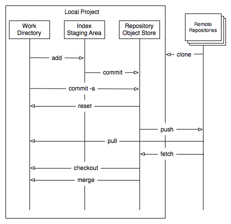

# Intro to Git
## Learning to use version control

---

## Agenda

* What is Git
* Creating a Repository
* Git Workflow
* Command Basics
* Merging

---

## What is Git

Git is a version control system that is used for software development and other
version control tasks. As a distributed revision control system it is aimed at
speed, data integrity, and support for distributed, non-linear workflows

---

## Creating a Repository

To create a new repository, the command `'git init'` is used, within your directory.
The repository is contained within the `'.git'` folder.

---

## The Git Workflow

Within your local repository there are three trees that are maintained by Git.
Different Git commands allow you to interact with these trees and move code
between them.

---

## The Git Workflow

_Working Directory:_ Consists of the actual files you are working on.

---

## The Git Workflow

_Staging Area (Index):_ used for preparing commits. All changes that you want to
commit are staged on the first. The index provides greater control over what
changes should be committed into the Repository.

---

## The Git Workflow

_Object Store (Repository):_ Contains committed changes from the staging area.

---

## The Git Workflow

---

## Add

Files can be added to the staging area by using either `'git add <filename>'` for
a single file or `'git add .'` or `'git add --all'` for all modified files.

---

## Commit

To commit the files from the staging area to the local repository use
`'git commit -m "comment"'` or the more preferred `'git commit'`.

Leaving off the `'-m'` will open a text editor which will allow you to create a
better formatted and more informative commit message.

---

## Branches

Branches are used to develop new features _in isolation_. Once the changes/branch
have been tested, the branch is then merged back into master branch. The feature
branch is then _deleted_. Below are the main branch commands:

---

## Branches

_Create new Branch:_ `'git checkout -b <branch name>'`

_Switch Branches:_ `'git checkout <branch name>'`

_Delete Branch locally:_ `'git branch -d <branch name>'`

_List all Branches:_ `'git branch'`

---

## Pushing

To push the changes from your local repository to a remote repository (i.e
GitHub/BitBucket/GitLab) enter `'git push origin <branch name>'`. It is worth
noting that `'<branch name>'` relates to the name of the remote branch.

---

## Remotes

Remotes are repositories that are _not_ local to you. Places like
GitHub/BitBucket/GitLab are all considered Remotes. If you have cloned a
repository you already have a remote setup. If you are creating one for the
first time you need to setup your own remote.

---

## Remotes

**__It is important to note that a repository can have more than one remote.
This is common when working in large software projects.__**

---

## Remotes

The most common Remote names are `'origin'` and `'upstream'`. These are just
placeholder name. You can call your Remotes anything you desire. Typically
`'origin'` refers to the remote that you own or your core team maintains.
`'upstream'` typically refers to the Remote that you are contributing to not as a
core team member but as a collaborator.

---

## Remotes

You can add Remotes with the following command:
`'git remote add <remote name> <repository url>'`

---

## Updating Your Local Branch

To update your local branch/repository with new commits, you can either perform a
pull or a fetch then merge.

---

## Updating Your Local Branch

_Git Fetch:_ Obtains new commits from the remote repo and adds them within the
local repository; `'git fetch <remote>'`.

_Git Merge:_ Is used to merge the changes obtained via `'git fetch'` to the local
branch; `'git merge <remote>/<branch name>'`.

_Git Pull:_ Executes a `'fetch'` followed by a `'merge'`.

---

## Updating Your Local Branch

`'Pull'` is _not_ an atomic command and can be configured to behave differently.
For that reason it is preferred to ust `'fetch'` and `'merge'` since they are both
atomic commands and will always have the same behavior.

---

## Clone

Allows you to download the repository locally, along with all of the commit
history using the git client. This method names your remote `'origin'` and sets
the url to the project you cloned from.

`'git clone <repository url>'`

---

## Fork

Creates a copy of the repository within your own GitHub/BitBucket/GitLab
account. `'fork'` _is not_ a feature of git and is only able to be done through
the webUI. After you `'fork'` a repository you still must `'clone'` the repository
locally.

---

## Fork

**__It is worth noting that when you `'fork'` a repository your remote is named
`'origin'` and is set to the copy in your account. You must manually setup a
second remote pointing to the main project__**

---

## Merge

There are 3 ways that changes are merged by Git.

---

## Merge

_Fast-Forward:_ No changes are detected on the parent branch. All other
commits are added to the parent branch, appearing like there was never a branch.

---

## Merge

_Automatic:_ Occurs when non-conflicting merges occur. The child branch timeline
is preserved and a automatic merge commit is created to show the merging of the
2 branches.

---

## Merge

_Manual_ Occurs when git is unable to automatically resolve any conflicts. All
merge conflicts must be resolved before proceeding.

---

## Merge

**__It is worth noting that while you can do merges via the git tool itself it
is most commonly done via the webUI__**

---

## Sources

[A Beginners Guide to
Git](https://www.fir3net.com/UNIX/Linux/a-beginners-guide-to-git.html)
