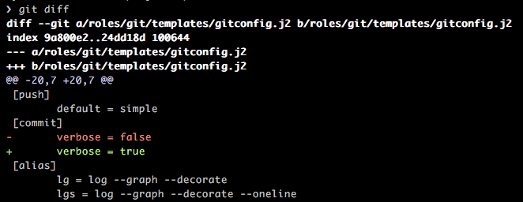
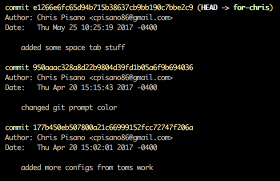

# Intro to Git
## Learning to use version control

---

## Agenda

* Finding Remotes
* Checking Status
* Viewing Changes
* Querying the Log

---

## Finding Remotes

It is possible to have multiple remotes configured for a single repository. Each
of these remotes has a different url associated with it. For commands like
`'push'` and `'fetch'` there are many scenarios where one needs to know the name of
a specific remote.

---

## Finding Remotes

`'git remote'` and `'git remote -v'` will show you a list of all configured remotes
for the repository.

---

## Viewing the Status

It is possible for your working tree to have different types of changes waiting
to be committed. Viewing these changes is a simple command.

---

## Viewing the Status

`'git status'`

Displays paths that have differences between the index file and the current HEAD
commit, paths that have differences between the working tree and the index file,
and paths in the working tree that are not tracked by git.

---

## Viewing the Status

---

## Viewing Changes

`'git status'` displays the paths that have changed but it does not display
_what_ has changed. In order to see the actual content changed, known as the
_diff_, a diferent command is needed.

---

## Viewing Changes

`'git diff'`

Displays the difference between the working directory and the staging area.

---

## Viewing Changes

After you have done a `'git add'` you might notice that `'git diff'` does not
show you what has changed anymore. This is because by executing `'git add'` you
have moved the files from the working directory to the staging area. 

---

## Viewing Changes

`'git diff --staged'`

Displays the difference between what is staged for the next commit and HEAD.

---

## Querying the Log

Git keeps a log of everything that has been done in the repository. This log
contains information about the author of the code as well as the commit message
that corresponds to the change. This history distributed with every copy of the
repository.

---

## Querying the Log

`'git log'`

---

## Querying the Log

**__It is important to note that the `'git log'` command will also denote a
merge commit from a regular commit.__**

---

## Sources

[A Beginners Guide to
Git](https://www.fir3net.com/UNIX/Linux/a-beginners-guide-to-git.html)

[git-scm.com](https://git-scm.com/docs/)
